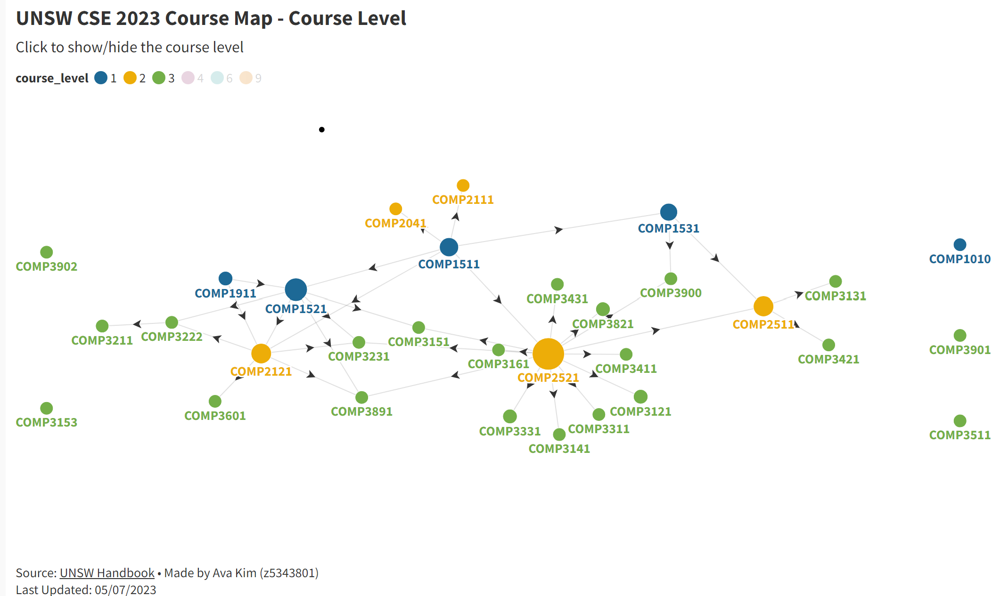
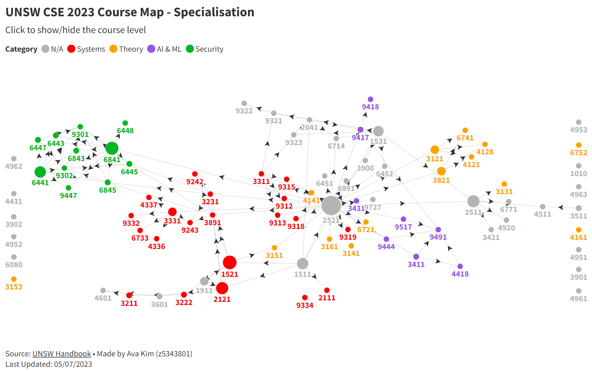

## UNSW-CSE-2023-Course-Map
This is an interactive network graph visualising the Computer Science and Engineering (CSE) courses provided by the University of New South Wales (UNSW) in 2023.
Inspired by [The CSE Course Map](https://media.csesoc.org.au/2021-fyg-cse-pathways/), this project aims to provide an intuitive and user-friendly tool for students to plan their course pathway effectively. It showcases course codes, titles, prerequisites, categories, and levels for a comprehensive understanding of the course structure.

Built with [Flourish](https://flourish.studio/)

<h3>By Course Level:</h3>
To interact with the graph and explore more, click here.

<h3>By Specialisation:</h3>
To interact with the graph and explore more, click here.

